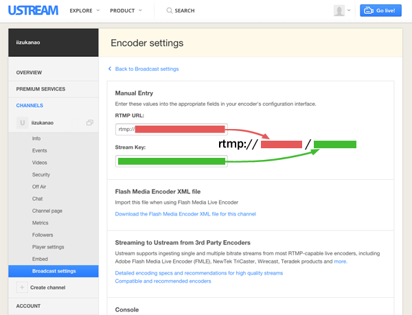

### picam

### Features

- Capture video from Raspberry Pi Camera and encode it to H.264 using hardware encoder
- Capture audio from USB microphone or Wolfson Audio Card via ALSA and encode it to AAC-LC using libavcodec (FFmpeg)
- Record audio/video to MPEG-TS files
- Generate files for HTTP Live Streaming with optional encryption
- If microphone is not available, it only records the video

### Performance (Latency)

Time from real motion to playback on Strobe Media Player over RTMP:

| Video bitrate | Minimum latency |
| ------------: | --------------: |
| 300 Kbps      |         0.3 sec |
| 500 Kbps      |         0.6 sec |
|   1 Mbps      |         0.8 sec |
|   2 Mbps      |         1.0 sec |
|   3 Mbps      |         1.3 sec |

**In HTTP Live Streaming (HLS), the latency will never go below 3-4 seconds.** This limitation stems from the design of HLS.

The above results were tested with:

- Video: 1280x720, 30 fps, GOP size 30
- Audio: 48 Khz mono, 40 Kbps
- RTMP Server: [node-rtsp-rtmp-server](https://github.com/iizukanao/node-rtsp-rtmp-server)
- Client: Flash Player 14,0,0,145 on Firefox 31.0 for Mac, using [test/strobe_media_playback.html](https://github.com/iizukanao/picam/blob/master/test/strobe_media_playback.html)
- Network: Wi-Fi network created by a USB dongle attached to Raspberry Pi

### Required hardware

- Raspberry Pi
- Raspberry Pi Camera Board
- USB microphone (see [Recommended hardware](#recommended-hardware)) or Wolfson Audio Card

### Supported operating systems

- Raspbian
- Arch Linux

### Installation

picam binary is available at https://github.com/iizukanao/picam/releases/latest

[picam preinstalled Raspbian image](http://s.kyu-mu.net/raspbian-picam/) is also available. If you use an SD card larger than 4GB, run `raspi-config` and expand the filesystem after you boot Raspbian.

If you want to build picam yourself, see [INSTALL.md](INSTALL.md).

### Usage

#### Finding ALSA device name

First, find ALSA device name of your microphone.

    $ arecord -l
    **** List of CAPTURE Hardware Devices ****
    card 1: Device [USB PnP Sound Device], device 0: USB Audio [USB Audio]
      Subdevices: 1/1
      Subdevice #0: subdevice #0

ALSA device name is consisted of `hw:<card>,<device>`. In the above example, the ALSA device name is `hw:1,0`.

If you got `no soundcards found` error, try `sudo arecord -l`. If that output looks good, you might want to add your user to `audio` group.

    $ sudo usermod -a -G audio $USER
    (once logout, then login)
    $ groups
    wheel audio pi  <-- (make sure that audio is in the list)
    $ arecord -l
    **** List of CAPTURE Hardware Devices ****
    card 1: Device [USB PnP Sound Device], device 0: USB Audio [USB Audio]
      Subdevices: 1/1
      Subdevice #0: subdevice #0

#### Starting picam

Run picam with your ALSA device name.

    $ ./picam --alsadev hw:1,0
    configuring devices
    capturing started

#### Create symbolic links (optional, but strongly recommended)

You can take advantage of RAM drive (/run/shm/) and reduce access to SD card. It also provides better quality of recording.

First, stop picam if it is running. Create **rec**, **hooks**, and **state** directories in /run/shm/, then change directories with the same name in picam to symbolic links. Create another symbolic link from /run/shm/rec/archive to somewhere on SD card.

Result:

    picam
    | ...
    |-- archive
    |-- hooks -> /run/shm/hooks
    |-- rec -> /run/shm/rec
    `-- state -> /run/shm/state

    /run/shm/
    |-- hooks
    |-- rec
    |   |-- archive -> /home/pi/picam/archive
    |   `-- tmp (automatically created by picam)
    `-- state

#### Recording

To start recording, create a file named `hooks/start_record` while picam command is running.

    $ touch hooks/start_record

You will see `start rec` in the picam command output.

To stop recording, create a file named `hooks/stop_record`.

    $ touch hooks/stop_record

The recorded MPEG-TS file is in rec/archive/ directory.

To convert MPEG-TS to MP4, run:

    $ ffmpeg -i test.ts -c:v copy -c:a copy -bsf:a aac_adtstoasc test.mp4

#### Mute/Unmute

To mute microphone temporarily, create a file named `hooks/mute`.

    $ touch hooks/mute

To unmute microphone, create a file named `hooks/unmute`.

    $ touch hooks/unmute

#### Command options

    $ ./picam --help
    picam version 1.3.3
    Usage: picam [options]
    
    Options:
     [video]
      -w, --width <num>   Width in pixels (default: 1280)
      -h, --height <num>  Height in pixels (default: 720)
      -v, --videobitrate <num>  Video bit rate (default: 2000000)
                          Set 0 to disable rate control
      -f, --fps <num>     Frame rate (default: 30.0)
      -g, --gopsize <num>  GOP size (default: same value as fps)
      --vfr               Enable variable frame rate. GOP size will be
                          dynamically controlled.
      --minfps <num>      Minimum frames per second. Implies --vfr.
                          It might not work if width / height >= 1.45.
      --maxfps <num>      Maximum frames per second. Implies --vfr.
                          It might not work if width / height >= 1.45.
      --rotation <num>    Image rotation in clockwise degrees
                          (0, 90, 180, 270)
      --hflip             Flip image horizontally
      --vflip             Flip image vertically
      --avcprofile <str>  Set AVC/H.264 profile to one of:
                          constrained_baseline/baseline/main/high
                          (default: constrained_baseline)
      --avclevel <value>  Set AVC/H.264 level (default: 3.1)
      --qpmin <num>       Minimum quantization level (0..51)
      --qpmax <num>       Maximum quantization level (0..51)
      --qpinit <num>      Initial quantization level
      --dquant <num>      Slice DQuant level
     [audio]
      -c, --channels <num>  Audio channels (1=mono, 2=stereo)
                          Default is mono. If it fails, stereo is used.
      -r, --samplerate <num>  Audio sample rate (default: 48000)
      -a, --audiobitrate <num>  Audio bit rate (default: 40000)
      --alsadev <dev>     ALSA microphone device (default: hw:0,0)
      --volume <num>      Amplify audio by multiplying the volume by <num>
                          (default: 1.0)
      --noaudio           Disable audio capturing
      --audiopreview      Enable audio preview
      --audiopreviewdev <dev>  Audio preview output device (default: plughw:0,0)
     [HTTP Live Streaming (HLS)]
      -o, --hlsdir <dir>  Generate HTTP Live Streaming files in <dir>
      --hlsenc            Enable HLS encryption
      --hlsenckeyuri <uri>  Set HLS encryption key URI (default: stream.key)
      --hlsenckey <hex>   Set HLS encryption key in hex string
                          (default: 75b0a81de17487c88a47507a7e1fdf73)
      --hlsenciv <hex>    Set HLS encryption IV in hex string
                          (default: 000102030405060708090a0b0c0d0e0f)
     [output for node-rtsp-rtmp-server]
      --rtspout           Enable output for node-rtsp-rtmp-server
      --rtspvideocontrol <path>  Set video control socket path
                          (default: /tmp/node_rtsp_rtmp_videoControl)
      --rtspaudiocontrol <path>  Set audio control socket path
                          (default: /tmp/node_rtsp_rtmp_audioControl)
      --rtspvideodata <path>  Set video data socket path
                          (default: /tmp/node_rtsp_rtmp_videoData)
      --rtspaudiodata <path>  Set audio data socket path
                          (default: /tmp/node_rtsp_rtmp_audioData)
     [MPEG-TS output via TCP]
      --tcpout <url>      Enable TCP output to <url>
                          (e.g. --tcpout tcp://127.0.0.1:8181)
     [camera]
      --autoex            Enable automatic control of camera exposure between
                          daylight and night modes. This forces --vfr enabled.
      --autoexthreshold <num>  When average value of Y (brightness) for
                          10 milliseconds of captured image falls below <num>,
                          camera exposure will change to night mode. Otherwise
                          camera exposure is in daylight mode. Implies --autoex.
                          (default: 5.0)
                          If --verbose option is enabled as well, average value of
                          Y is printed like y=28.0.
      --wb <value>        Set white balance. <value> is one of:
                            off: Disable exposure control
                            auto: Automatic white balance control (default)
                            sun: The sun provides the light source
                            cloudy: The sun provides the light source through clouds
                            shade: Light source is the sun and scene is in the shade
                            tungsten: Light source is tungsten
                            fluorescent: Light source is fluorescent
                            incandescent: Light source is incandescent
                            flash: Light source is a flash
                            horizon: Light source is the sun on the horizon
      --metering <value>  Set metering type. <value> is one of:
                            average: Center weight average metering (default)
                            spot: Spot (partial) metering
                            matrix: Matrix or evaluative metering
                            backlit: Assume a backlit image
      --evcomp <num>      Set Exposure Value compensation (-10..10) (default: 0)
      --shutter <num>     Set shutter speed in microseconds (default: auto).
                          Implies --vfr.
      --iso <num>         Set ISO sensitivity (100..800) (default: auto)
      -p, --preview       Display fullscreen preview
      --previewrect <x,y,width,height>
                          Display preview window at specified position
      --opacity           Preview window opacity
                          (0=transparent..255=opaque; default=255)
      --query             Query camera capabilities then exit
     [misc]
      --recordbuf <num>   Start recording from <num> keyframes ago
                          (default: 5)
      --statedir <dir>    Set state dir (default: state)
      --hooksdir <dir>    Set hooks dir (default: hooks)
      -q, --quiet         Suppress all output except errors
      --verbose           Enable verbose output
      --version           Print program version
      --help              Print this help

#### Changing the white balance

The white balance can be set either via command line option or hooks. To change the white balance while picam is running, create `hooks/wb_<wbname>`, where `<wbname>` is the white balance name.

For example, the following command changes the white balance to **sun**.

    $ touch hooks/wb_sun

### HTTP Live Streaming

HTTP Live Streaming is disabled by default. To enable HTTP Live Streaming and generate files in /run/shm/hls, run:

    $ ./picam -o /run/shm/hls

#### Encryption

Optionally you can enable encryption for HTTP Live Streaming. We will use the following settings as an example.

- **HTTP Live Streaming output directory**: /run/shm/hls/
- **Encryption key**: 0xf0f1f2f3f4f5f6f7f8f9fafbfcfdfeff
- **Encryption IV**:  0x000102030405060708090a0b0c0d0e0f
- **Encryption key file**: enc.key

First you have to create a file named "enc.key" which contains 16-byte encryption key. To create such file, run:

    $ echo -n $'\xf0\xf1\xf2\xf3\xf4\xf5\xf6\xf7\xf8\xf9\xfa\xfb\xfc\xfd\xfe\xff' > enc.key

Put enc.key in /run/shm/hls/ directory. Then, run picam with the following options:

    $ ./picam -o /run/shm/hls --hlsenc --hlsenckeyuri enc.key \
      --hlsenckey f0f1f2f3f4f5f6f7f8f9fafbfcfdfeff \
      --hlsenciv 000102030405060708090a0b0c0d0e0f

You can watch the HTTP Live Streaming by accessing /run/shm/hls/index.m3u8 via HTTP or HTTPS with QuickTime Player.

### Using picam in combination with nginx-rtmp-module

To use picam with [nginx-rtmp-module](https://github.com/arut/nginx-rtmp-module), add the following lines to nginx.conf:

    rtmp {
        server {
            listen 1935;
            chunk_size 4000;
            application webcam {
                live on;

                exec_static /path/to/ffmpeg -i tcp://127.0.0.1:8181?listen
                                            -c:v copy -ar 44100 -ab 40000
                                            -f flv rtmp://localhost:1935/webcam/mystream;
            }
        }
    }

Note that `/path/to/ffmpeg` should be replaced with the actual absolute path to ffmpeg command.

Start nginx server, then run:

    $ ./picam --tcpout tcp://127.0.0.1:8181

You can access your live stream at `rtmp://YOUR_RASPBERRYPI_IP/webcam/mystream`.

### Publishing to Ustream

To upload streams from picam to Ustream, run ffmpeg with the following options. `RTMP_URL` and `STREAM_KEY` can be obtained from Ustream's Channel settings &rarr; Broadcast settings &rarr; Encoder settings.

    $ ffmpeg -i tcp://127.0.0.1:8181?listen -c:v copy -c:a aac -strict -2 -ar 44100 -ab 40000 -f flv RTMP_URL/STREAM_KEY

Then, run picam to start streaming.

    $ picam --tcpout tcp://127.0.0.1:8181

### Recommended hardware

#### USB microphone

Any cheap USB microphone should work as long as it is supported by ALSA. I have tested this program with the combination of:

- USB to 3.5mm audio adapter: [PLANEX PL-US35AP](http://www.planex.co.jp/product/usb/pl-us35ap/)
- Microphone: [ELECOM MS-STM95](http://www2.elecom.co.jp/multimedia/microphone/ms-stm95/)

### License

LGPL v2.1, as some parts of FFmpeg source is included.
